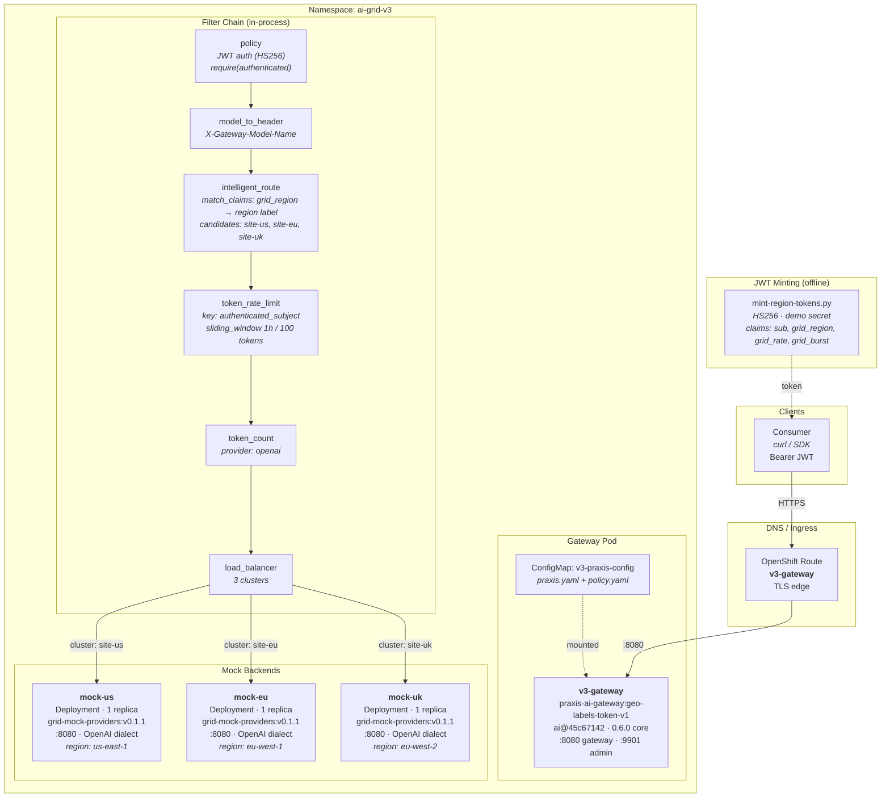

# AI Grid v3 Demo — Deployment Layout

## Request Flow

1. **Consumer** sends `POST /v1/chat/completions` with `Authorization: Bearer <JWT>`
2. **policy** — verifies HS256 JWT (issuer, audience, signature). 401 if invalid
3. **model_to_header** — extracts `model` from body, promotes to `X-Gateway-Model-Name`
4. **intelligent_route** — reads `grid_region` claim from JWT, matches against candidate labels. Picks the cluster whose `region` label matches. 403 if no region claim (fail-closed)
5. **token_rate_limit** — checks per-subject sliding window budget. 429 if exhausted
6. **token_count** — reads token usage from upstream response (OpenAI format)
7. **load_balancer** — forwards to the selected cluster endpoint (mock-us/eu/uk)

## Tokens

| Name | Subject | grid_region | Routes to |
|------|---------|-------------|-----------|
| US | us-user | us-east-1 | mock-us (site-us) |
| EU | eu-user | eu-west-1 | mock-eu (site-eu) |
| UK | uk-user | eu-west-2 | mock-uk (site-uk) |
| NONE | noregion-user | *(absent)* | 403 fail-closed |
